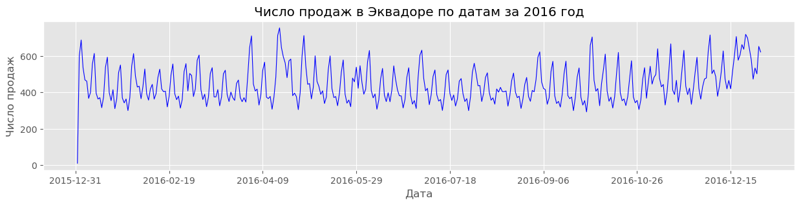
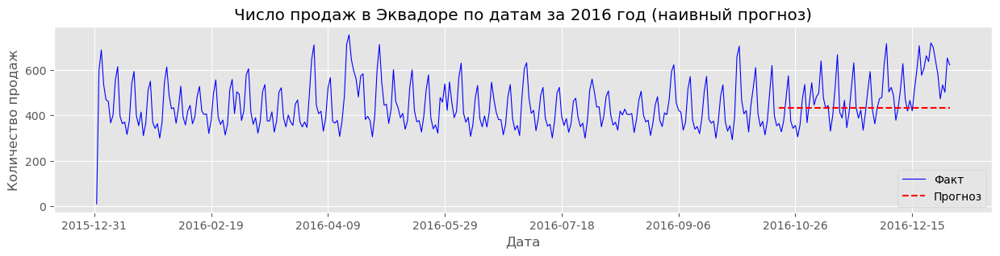
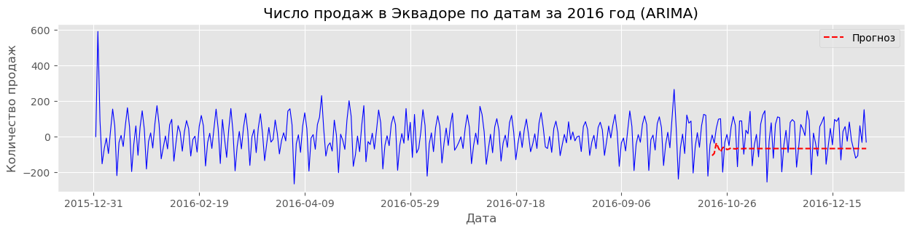
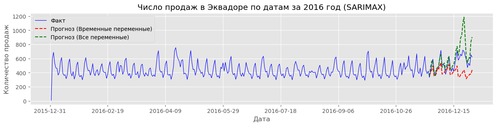
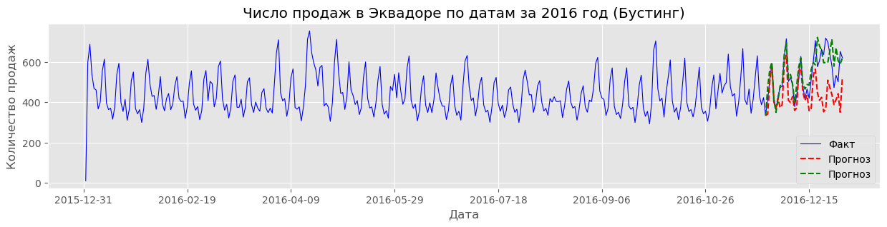

Проект выполнили: **Кирякин Максим, Куренкова Дарья, Коваль Наталия**

* Отчет находится в директории `Report/report.pdf`

* Код проекта находся в файле `Project1.ipynb`

## Постановка задачи

В работе было необходимо построить прогноз значений временного ряда с помощью моделей эконометрики, рассмотренных в курсе.

Модель ARIMA(p,d,q) - это расширение моделей типа ARMA на нестационарные временные ряды, которые однако могут стать стационарным после применения процедуры дифференцирования ряда. Модель ARIMA(p, d, q) для ряда $y_t$ определяется как модель ARMA(p,q) для ряда разностей порядка d ряда $y_t$.

$\textbf{ARIMA(p, d, q)}$ модель:

$$
\begin{align*}
	\Delta^d y_t = \alpha_1 \Delta^d y_{t-1} + ... + \alpha_p\Delta^dy_{t-p} + \varepsilon_t + \beta_1\varepsilon_{t-1} + ... + \beta_q\varepsilon_{t-q},
\end{align*}
$$

Обобщение модели ARIMA на ряды с наличием сезонной составляющей назвается SARIMA. Пусть s — известная сезонность ряда. Добавим в модель ARIMA(p,d,q) компоненты, отвечающие за значения в предыдущие сезоны.

$\textbf{SARIMA(p, d, q)(P, D, Q)s}$ модель:

$$
\begin{align*}
	\Delta^D_s\Delta^d y_t 
	&= \alpha_1\Delta^D_s \Delta^d y_{t-1} + \dots + \alpha_p\Delta^D_s\Delta^dy_{t-p} \\
	&\quad+ \varepsilon_t + \beta_1\varepsilon_{t-1} + \dots + \beta_q\varepsilon_{t-q} \\
	&\quad+ \alpha_1^s\Delta^D_s \Delta^d y_{t-s} + \dots + \alpha_p^s\Delta^D_s \Delta^d y_{t-ps} \\
	&\quad+ \beta_1^s\varepsilon_{t-s}+\beta_Q^s\varepsilon_{t-Qs}.
\end{align*}
$$

Обобщением SARIMA модели является SARIMAX модель.
SARIMAX (Seasonal AutoRegressive Integrated Moving Average with eXogenous inputs) – это эконометрическая модель для прогнозирования временных рядов с учетом сезонности и внешних факторов.

## Данные

В работе решалась задача прогнозирования числа продаж в сети магазинов Эквадора за 2016 год. [Данные](https://www.kaggle.com/c/store-sales-time-series-forecasting/data) были взяты с сайта Kaggle. Всего в работе использовались 3 файла (train.csv, stores.csv, oil.csv), на основе которых формировался итоговый датасет. График динамики переменной-таргета (число продаж) приведен на рисунке:

<figure id="sales-2016" style="margin: 0; width: 100%;">
  
  <figcaption style="text-align: center;">Динамика числа продаж в эквадоре за 2016 год.</figcaption>
</figure>

Одним из важных этапов выполнения работы была подготовка данных. Она включала в себя формирование единого датасета, кодировку категориальных переменных, отбор признаков и заполнение пропусков.

## Ход работые
### Модели и их спецификация

Было рассмотрено 3 модели прогнозирования значений временного ряда:

- ARIMA модель с ручной настройкой параметров p, d и q.

- SARIMAX модель.

- Модель машинного обучения (градиентный бустинг, XGBRegressor).

При этом отбор параметров для ARIMA модели осуществлялся с помощью функций частичной автокорреляций и теста Дики-Фуллера. Перебор гиперпараметров для модели градиентного бустинга производился с помощью библиотеки `hyperopt`, в основе которой лежит принцип байесовской оптимизации. При переборе гиперпараметров также производилась кросс-вализация расширяющимся окном. Подробнее о специфике подбора гиперпараметров можно прочитать в отчете к проекту.

В качестве метрик оценки качества предсказания модели использовались метрики: MSE, MAE, RMSE, MAPE.

### Наивный прогноз

В качестве наивного прогноза использовалось среднее значение продаж в Эквадоре за последние 3 месяца 2016 года. График наивного прогноза приведен на рисунке:

<figure style="margin: 0; width: 100%;">
  
  <figcaption style="text-align: center;">Наивный прогноз для продаж в Эквадоре.</figcaption>
</figure>

Значения используемых в работе метрик приведены в таблице:

<table style="width: 100%;">
    <tr>
        <th style="text-align: right;">Метрики</th>
        <th style="text-align: right;">MSE</th>
        <th style="text-align: right;">RMSE</th>
        <th style="text-align: right;">MAE</th>
        <th style="text-align: right;">Процентная ошибка</th>
    </tr>
    <tr>
        <td style="text-align: right;">Наивный прогноз</td>
        <td style="text-align: right;">20703.85</td>
        <td style="text-align: right;">143.88</td>
        <td style="text-align: right;">114.75</td>
        <td style="text-align: right;">0.2</td>
    </tr>
</table>

### ARIMA модель

Результаты работы ARIMA модели проведены на рисунке:

<figure style="margin: 0; width: 100%;">
  
  <figcaption style="text-align: center;">Прогноз ARIMA модели для числа продаж в Эквадоре.</figcaption>
</figure>

Из графика видно, что модель не улавливает динамику ряда и очень скоро прогноз превращается в константный. Значения метрик приведены в таблице:

<table style="width: 100%;">
    <tr>
        <th style="text-align: right;">Метрики</th>
        <th style="text-align: right;">MSE</th>
        <th style="text-align: right;">RMSE</th>
        <th style="text-align: right;">MAE</th>
        <th style="text-align: right;">Процентная ошибка</th>
    </tr>
    <tr>
        <td style="text-align: right;">ARIMA модель</td>
        <td style="text-align: right;">11908.6</td>
        <td style="text-align: right;">109.13</td>
        <td style="text-align: right;">93.53</td>
        <td style="text-align: right;">1.491</td>
    </tr>
</table>

### SARIMAX модель

Главное отличие SARIMAX модели от ARIMA модели -- ее способность учитывать сезонность в предсказании, а также дополнительные параметры, помимо значений самого ряда. В качестве дополнительных параметров в модель подавались значения числа продаж в дату, цена топлива и числа акций в магазинах. Обучение модели проходило автоматически с помощью пакета `statsmodels` языка Python. Кроме того, модель обучалась два раза: в первый раз - только на временных и лаговых переменных, во второй - с дополнительными переменными.
Результаты предсказания модели приведены на рисунке:

<figure style="margin: 0; width: 100%;">
  
  <figcaption style="text-align: center;">Прогноз SARIMAX модели для числа продаж в Эквадоре.</figcaption>
</figure>

Из графика видно, что качество предсказаний модели с дополнительными переменных лучше, чем качество предсказаний модели, которая обучалась только на лаговых переменых. Однако необходимо учитывать, что для прогноза в будущее, в случае выбора первой модели, нужно будет отдельно предсказывать значения драйверов. Значения метрик приведены в таблице:

<table style="width: 100%;">
    <tr>
        <th style="text-align: right;">Метрики</th>
        <th style="text-align: right;">MSE</th>
        <th style="text-align: right;">RMSE</th>
        <th style="text-align: right;">MAE</th>
        <th style="text-align: right;">Процентная ошибка</th>
    </tr>
    <tr>
        <td style="text-align: right;">Временные переменные</td>
        <td style="text-align: right;">24258.07</td>
        <td style="text-align: right;">155.75</td>
        <td style="text-align: right;">125.47</td>
        <td style="text-align: right;">0.22</td>
    </tr>
    <tr>
        <td style="text-align: right;">Временные переменные + дополнительные</td>
        <td style="text-align: right;">19785.57</td>
        <td style="text-align: right;">140.661</td>
        <td style="text-align: right;">88.76</td>
        <td style="text-align: right;">0.15</td>
    </tr>
</table>

### Бустинг

В работе рассматривался `XGBRegressor` из библиотеки `sklearn`. Обучение также как и для SARIMAX модели осуществлялось двумя подходами. Результаты предсказания модели приведены на рисунке:

<figure style="margin: 0; width: 100%;">
  
  <figcaption style="text-align: center;">Прогноз модели градиентного бустинга для числа продаж в Эквадоре.</figcaption>
</figure>

Таблица значений метрик качества:
<table style="width: 100%;">
    <tr>
        <th style="text-align: right;">Метрики</th>
        <th style="text-align: right;">MSE</th>
        <th style="text-align: right;">RMSE</th>
        <th style="text-align: right;">MAE</th>
        <th style="text-align: right;">Процентная ошибка</th>
    </tr>
    <tr>
        <td style="text-align: right;">Временные переменные</td>
        <td style="text-align: right;">14971.71</td>
        <td style="text-align: right;">122.36</td>
        <td style="text-align: right;">86.83</td>
        <td style="text-align: right;">0.15</td>
    </tr>
    <tr>
        <td style="text-align: right;">Временные переменные + дополнительные</td>
        <td style="text-align: right;">2745.55</td>
        <td style="text-align: right;">52.4</td>
        <td style="text-align: right;">39.19</td>
        <td style="text-align: right;">0.07</td>
    </tr>
</table>

## Заключение

В работе была решена задача прогнозирования числа продаж в сети магазинов Эквадора за 2016 год. Было рассмотрено 3 модели прогнозирования значений временного ряда:

* ARIMA модель с ручной настройкой параметров p, d и q.
* SARIMAX модель.
* Модель машинного обучения (градиентный бустинг, XGBRegressor).

Было установлено, что среди эконометрических моделей лучше всего себя показала модель SARIMAX. Этот результат, в частности, обусловлен ее способностью учитывать внешние параметров, а не только прошлые значения ряда. 

Кроме того, в работе дополнительно был рассмотрен способ прогнозирования с помощью градиентного бустинга. Этот метод превзошел все эконометрические модели по качеству предсказаний. 

Более детальное описание хода работы можно найти в отчете.

